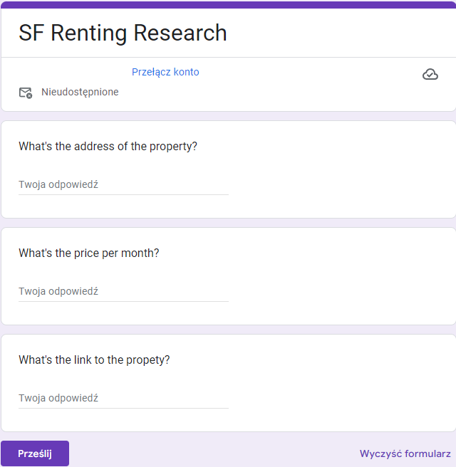

# Zillow scraper

Scrapping data from [Zillow](https://www.zillow.com/) about apartments and automatically submitting it via Google form.
The extracted data is available as a Google spreadsheet.

## Setup 
1. Create a googl form like the one in the image<br>

2. Paste link to forms in `main.py` as `FORM_URL`

## Run app
```
python ./main.py
```